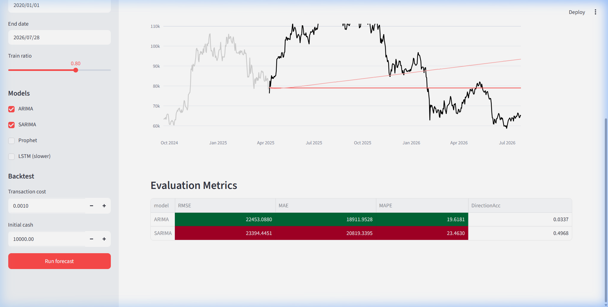

# VolatiliX: Multi-Asset Financial Analytics & Volatility Forecasting Platform

End-to-end financial analytics & market forecasting system evaluating Crypto (`BTC-USD`) and Tech Stocks (`NVDA`, `AAPL`) using classical time series models (ARIMA / SARIMA / Prophet) and deep learning architectures (LSTM). Ships with technical indicators, multi-asset quick presets, a long/flat strategy backtester, and an interactive Streamlit dashboard.

## Project Layout

```
.
├── config.yaml                # default ticker (BTC-USD), 6-year date window, model hyperparameters
├── requirements.txt
├── src/
│   ├── config.py              # config loader
│   ├── data_loader.py         # Yahoo Finance download + caching
│   ├── feature_engineering.py # SMA, EMA, RSI, Bollinger, MACD, returns
│   ├── volatility.py          # close-to-close, Parkinson, Garman-Klass
│   ├── evaluation.py          # RMSE, MAE, MAPE, direction accuracy
│   ├── backtest.py            # long/flat signal-driven backtest
│   ├── visualization.py       # matplotlib + plotly charts
│   ├── pipeline.py            # end-to-end train/evaluate/backtest
│   └── models/
│       ├── arima_model.py     # ARIMA + SARIMA (statsmodels)
│       ├── prophet_model.py   # Facebook Prophet
│       └── lstm_model.py      # Keras LSTM with walk-forward eval
├── scripts/
│   └── run_pipeline.py        # CLI entry point
├── dashboard/
│   └── app.py                 # Streamlit dashboard with preset asset selector
├── notebooks/
│   └── exploratory_analysis.ipynb
├── tests/
│   └── test_basic.py
└── results/                   # generated metrics, plots, saved models
```

## Setup

```bash
python -m venv .venv
source .venv/bin/activate          # Windows: .venv\Scripts\activate
pip install -r requirements.txt
```

## Run the Full Pipeline

```bash
python scripts/run_pipeline.py                       # uses config.yaml default (BTC-USD, 2020-2026)
python scripts/run_pipeline.py --ticker NVDA --no-lstm
python scripts/run_pipeline.py --ticker AAPL --start 2020-01-01 --end 2026-07-28
```

### Outputs Generated:
- `data/raw/{TICKER}.csv` — raw OHLCV market data
- `data/processed/{TICKER}_features.csv` — engineered technical indicators & volatility estimators
- `results/metrics.csv` — model performance comparison table
- `results/backtest.csv` — strategy equity curve vs buy-and-hold
- `results/plots/*.png` — indicator, forecast, and drawdown charts
- `results/models/*` — serialized model checkpoints

## Launch the Interactive Dashboard

```bash
streamlit run dashboard/app.py
```

The Streamlit web dashboard features a sidebar asset preset selector:
- **`BTC-USD (Bitcoin)`**: 24/7 crypto high-volatility market
- **`NVDA (NVIDIA)`**: AI-boom momentum stock
- **`AAPL (Apple)`**: Large-cap tech baseline
- **`TSLA / MSFT / Custom`**: Any ticker symbol on Yahoo Finance

### Four Main Dashboard Tabs:
1. **Overview** — Candlestick + Volume charts with moving average overlays.
2. **Indicators** — Bollinger Bands, RSI, MACD, and Realised Volatility (Garman-Klass, Parkinson).
3. **Forecasts** — Interactive model selection (ARIMA, SARIMA, Prophet, LSTM) with walk-forward predictions & evaluation metrics table.
4. **Backtest** — Long/flat strategy simulation, equity vs. buy-and-hold comparison, Sharpe ratio, and Max Drawdown stats.

## Screenshots

### Interactive Streamlit Dashboard (`BTC-USD` Forecast & Metrics)


## Configuration

Edit `config.yaml` to customize default parameters:

- `data` — default ticker (`BTC-USD`), 6-year date range (`2020-01-01` to `2026-07-28`), interval (`1d`)
- `features` — moving average windows `[5, 10, 20, 50]`, RSI period `14`, Bollinger bands, Volatility window `21`
- `models` — ARIMA `order`, SARIMA `order` + `seasonal_order`, Prophet seasonality, LSTM lookback/units/epochs
- `backtest` — initial capital ($10,000) and transaction cost model

## Models Supported

| Model   | Library     | Strengths                              | Notes                                |
| ------- | ----------- | -------------------------------------- | ------------------------------------ |
| ARIMA   | statsmodels | Simple, interpretable                  | Captures autoregressive structure    |
| SARIMA  | statsmodels | Adds weekly seasonality                | Captures periodic cycle patterns     |
| Prophet | prophet     | Trend + multi-seasonality + holidays   | Handles missing dates gracefully     |
| LSTM    | TensorFlow  | Non-linear, long-range sequence data   | Walk-forward evaluation over test set|

## Evaluation & Strategy Backtest

Each model is evaluated on **RMSE**, **MAE**, **MAPE**, and **Direction Accuracy** (correct up/down movement predictions). The highest-performing model is automatically passed into the trading strategy backtester, producing Sharpe ratios, drawdown curves, and net return comparisons.

## Run Tests

```bash
pytest tests/
```

Unit tests run offline using synthetic market data.

---
